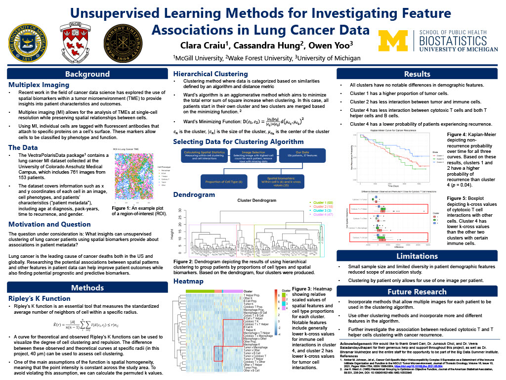

# Biostatistics

In the summer of '24, I had the great honor of participating in the [Big Data Summer Institue](https://sph.umich.edu/bdsi/), an NHLBI sponsored program that explores the intersection of big data and human health. This experience was a very formative one for my educational career, being the catalyst for my desires to pursue graduate school in biostatistics. 

  
   
  <em>Presenting at the end-of-program symposium</em>

During this program, I had the privilege of working with the Cancer Data Science team, being mentored by Dr. Veera Baladandayuthapani, Dr. Junsouk Choi, and Grant Carr. My project involves using spatial statistics and hierarchical clustering to see if any similar behaviors in the lung tumor microenvironment has any indications for patient metadata, with a particular focus on cancer recurrence using basic survival analysis. This project was done alongside [Cassi Hung](https://www.linkedin.com/in/cassandra-hung-035a89241/) and [Clara Craiu](https://www.linkedin.com/in/clara-craiu-3678b426a/). Feel free to read over my poster and reach out if you have any questions!

  

