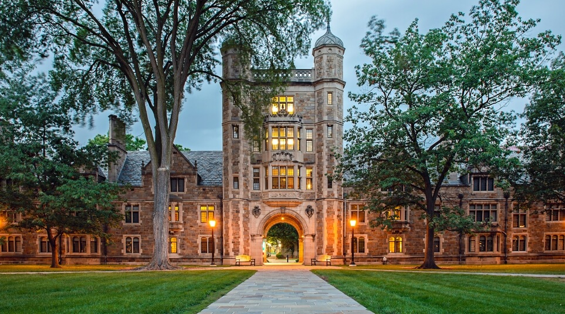

# Michigan (Go Blue!)

I had the incredible privilege of attending the University of Michigan. Here I mostly took classes within the Stats, Math, and EECS department, but have ventured outside to fulfill some of my personal curiosities.

  
   
  <em>The Law Quad at Michigan</em>

### Relevant Coursework

These courses are relevant to my background as a statistics and data science double major

-   **EECS 484**: Database Management System

-   **DATASCI 470**: Introduction to the Design of Experiments

-   **EPID 633**: Introduction to Mathematical Modeling in Epidemiology and Public Health

-   **MATH 451**: Advanced Calculus I

-   **STATS 426**: Introduction to Theoretical Statistics

-   **DATASCI 415**: Data Mining and Statistical Learning

-   **PUBHLTH 345**: Public Health Data Visualization

-   **STATS 413**: Applied Regression Analysis

-   **DATASCI 451**: Bayesian Data Analysis

-   **EECS 281**: Data Structures and Algorithms

-   **STATS 425**: Introduction to Probability

-   **STATS 306**: Introduction to Statistical Computing

-   **STATS 250**: Introduction to Statistics and Data Analysis

-   **EECS 280**: Programming and Introductory Data Structures

-   **EECS 203**: Discrete Math

-   **EECS 183**: Elementary Programming Concepts

-   **MATH 214**: Applied Linear Algebra

-   **MTH 293**: Calculus III (At Washtenaw Community College)

### Other Coursework

These courses were taken more as a personal passion. While not completely relevant to my major, they serve as a foundation for who I am and my belief in a multifaceted education.

-   **HISTORY 376**: Epidemics: Plagues and Cultures from the Black Death to the Present

-   **THEORY 137**: Introduction to the Theory of Music

-   **THEORY 137**: Introduction to Musical Analysis

-   **MUSICOL 123**: Introduction to Popular Music
