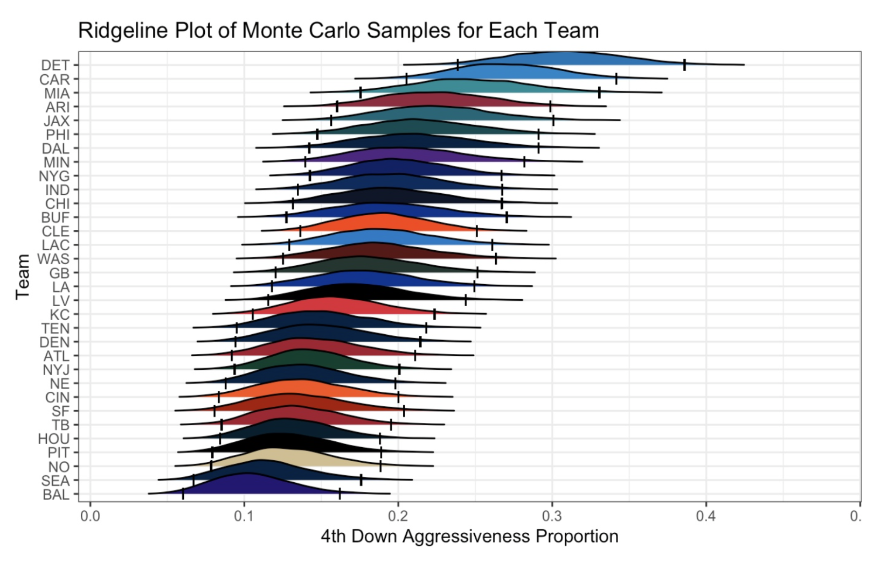

# Sports Analytics

When I'm not frantically worried about my R code or figuring out the probability of a royal flush, I enjoy watching football. I've had the enjoyment of watching Michigan football win the national championship and lions first playoff win since 1991 in 2024. My passion for football has also intersected with my love for data and statistics. I've been a member of Michigan Sports Analytics Society (MSAS) since January '23 and I've been co-president since April '24. I've done a couple of projects for the annual MSAS symposiums, and these were some of my first introduction to statistics R coding. I owe a lot to sports analytics, as it allowed me to fall in love with data even more and also allowed me to interact with cool people in cool places, including the MIT Sloan Sports Analytics Conference.

The projects mentioned here will specifically be in reference to projects made for the MSAS symposium

  
   
  <em>Attending the 2024 MIT Sloan Sports Analytics Conference</em>

## Variable Selection of Pressure and Pre-Snap Motion in the NFL

This project was created for both the NFL Big Data Bowl and the MSAS symposium '25. Using tracking data provided by the NFL, my groupmates consisting of [Ben Weber](https://www.linkedin.com/in/benweber5700/), [Eliana Detata](https://www.linkedin.com/in/eliana-detata-38867524a/), and [Bryce Carson](https://www.linkedin.com/in/brycecarson1/) investigated the relationship between pressure and pre-snap motion using a logistic regression model. AUC was used as an evaluation metric, and the best model's predictive accuracy was assessed. [Here is the link to the GitHub Repository.](https://github.com/owen-hy/NFL-BDB)

## Bayesian Analysis of NFL 4th Downs (Junior Year MSAS Project + DATASCI 451 Final Project)

This project was created for both the MSAS symposium '25 and as a final project for DATASCI 451: Bayesian Data Analysis. Using the nflFastR package, [Owen Swisher](https://www.linkedin.com/in/owen-swisher/) and I investigated 4th down aggression in the NFL, investigating the posterior distributions of every team's 4th down attempt rate and investigating whether head coaching experience played a factor in difference of aggressiveness. Some plots from this project are shown below. [Here is the link to the GitHub Repository.](https://github.com/owen-hy/Bayes-4thDown)

  
   
  

## Creation of Force over Expected (Sophomore Year MSAS Project)

This project was created for the MSAS symposium '24. Using NFL Big Data Bowl '23 data, me and my groupmates [Ben Weber](https://www.linkedin.com/in/benweber5700/) and [Eliana Detata](https://www.linkedin.com/in/eliana-detata-38867524a/) investigated tackling in the NFL, seeing factors that contributes to the force generated when tackling, and analyzing those outperforming their expected force. This project was published in the [2024 Spring edition of UPenn's Wharton Sports Research Journal](https://wsb.wharton.upenn.edu/wharton-sports-analytics-journal-2/2024-spring-edition/#Yoo). Some plots from this project are shown below. 

  
   
  

## Analysis of Kickers in the NFL (Freshman Year MSAS Project)

A project created for the MSAS symposium '23, I investigated kickers and the factors that goes into kicking accuracy using logistic regression. This helped create a "Field Goal over Expected" metric that analyzed the kickers that outperformed their expectation. A couple of plots from this project are shown below. 

  
   
  

