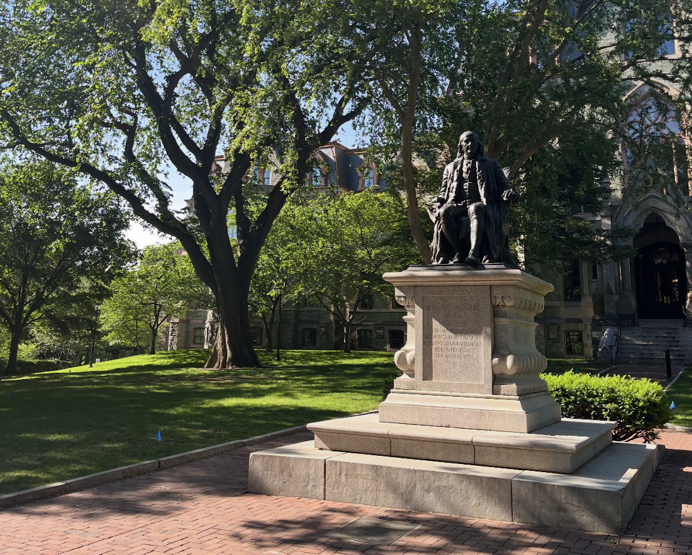

# Penn (Go Quakers!)

I currently have the incredible opportunity to attend the University of Pennsylvania as a Biostatistics PhD Student. 

  
   
  <em>Benjamin Franklin</em>

### Current Coursework

-   **BSTA 6200**: Probability

-   **BSTA 6510**: Linear Models

-   **BSTA 5110**: Biostatistics in Practice