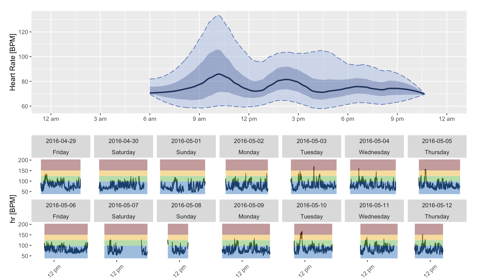

# Research

**Statistical Methods for Public Health**

I am interested in developing methods to improve the way we think about human health. From cancer imaging to wearable devices to measurement error, there are a wide range of health issues that demand the development of rigorous statistical methods for its evaluation. Notable projects from this include an R package for interpreting heart rate data from wearable devices and developing an average treatment effect estimator for misclassified outcomes in observational studies.

*Image from R package ihr*

**Analytics for American Football**

Current innovations within football data has driven the football analytics movement. With a sport as complicated as football, special considerations has to be made when considering the use and interpretation of statistical methods. I am interested in modeling player and team efficacy, and would love to start incorporating more rigorous methods from biostatistics (Survival, Causal) into football data. My previous projects here include a Bayesian analysis of 4th down conversions in the NFL and machine learning for pressure based on pre-snap motion.

*Image of Posterior Distribution of NFL Team's 4th down conversion probability*

